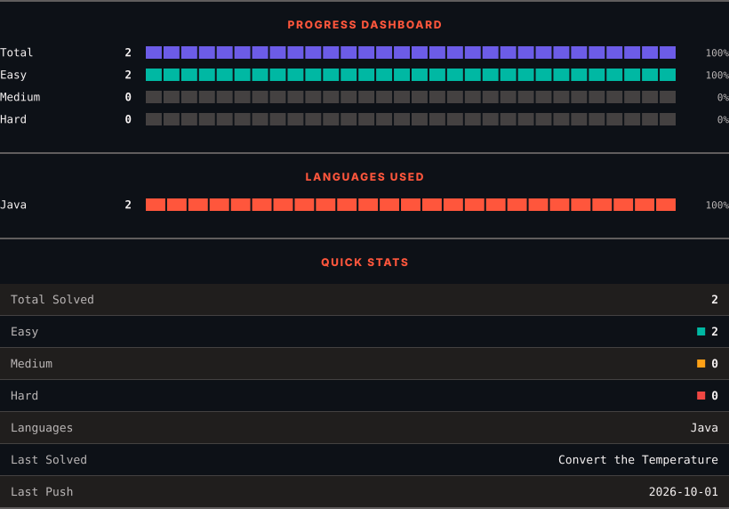
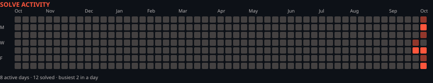

<h1>LeetCode Solutions</h1>

<em>Automatically synced with every accepted submission</em>

   

<picture>
  <source media="(prefers-color-scheme: dark)" srcset=".leetsync/stats-dark.svg">
  <source media="(prefers-color-scheme: light)" srcset=".leetsync/stats-light.svg">
  
</picture>

<picture>
  <source media="(prefers-color-scheme: dark)" srcset=".leetsync/calendar-dark.svg">
  <source media="(prefers-color-scheme: light)" srcset=".leetsync/calendar-light.svg">
  
</picture>

---

### ALL SOLUTIONS

| # | Problem | Difficulty | Language | Date |
|:---:|:--------|:----------:|:--------:|:----:|
| 9 | [Palindrome Number](problems/0009-Palindrome-Number) | 🟩 Easy | `Java` | 2026-10-08 |
| 412 | [Fizz Buzz](problems/0412-Fizz-Buzz) | 🟩 Easy | `Java` | 2026-10-01 |
| 1281 | [Subtract the Product and Sum of Digits of an Integer](problems/1281-Subtract-the-Product-and-Sum-of-Digits-of-an-Integer) | 🟩 Easy | `Java` | 2026-10-06 |
| 1342 | [Number of Steps to Reduce a Number to Zero](problems/1342-Number-of-Steps-to-Reduce-a-Number-to-Zero) | 🟩 Easy | `Java` | 2026-10-05 |
| 1491 | [Average Salary Excluding the Minimum and Maximum Salary](problems/1491-Average-Salary-Excluding-the-Minimum-and-Maximum-Salary) | 🟩 Easy | `Java` | 2026-10-08 |
| 1523 | [Count Odd Numbers in an Interval Range](problems/1523-Count-Odd-Numbers-in-an-Interval-Range) | 🟩 Easy | `Java` | 2026-10-05 |
| 1822 | [Sign of the Product of an Array](problems/1822-Sign-of-the-Product-of-an-Array) | 🟩 Easy | `Java` | 2026-10-04 |
| 1929 | [Concatenation of Array](problems/1929-Concatenation-of-Array) | 🟩 Easy | `Java` | 2026-10-09 |
| 2235 | [Add Two Integers](problems/2235-Add-Two-Integers) | 🟩 Easy | `Java` | 2026-09-30 |
| 2469 | [Convert the Temperature](problems/2469-Convert-the-Temperature) | 🟩 Easy | `Java` | 2026-10-01 |

---

Auto-synced by <strong>LeetSync</strong> · Built by <a href="https://deveshsamant.in/">Devesh Samant</a>

