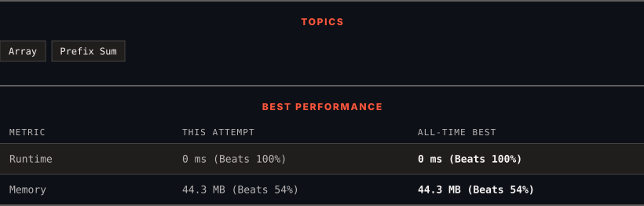

<div align="center">

# 1480. Running Sum of 1d Array

      

[](https://leetcode.com/problems/running-sum-of-1d-array/)

</div>

---

<div align="center">

<picture>
  <source media="(prefers-color-scheme: dark)" srcset="panel-dark.svg">
  <source media="(prefers-color-scheme: light)" srcset="panel-light.svg">
  
</picture>

</div>

### HOW IT WENT

| | |
|:--|:--|
| **Attempts** | 2 before accepted |
| **Time to solve** | 7 min |
| **Verdicts** | ✅ Accepted → ✅ Accepted |

---

### NOTES

_No notes yet._

---

### SOLUTIONS (2)

| # | File | Language | Date |
|:-:|------|:--------:|:----:|
| 1 | [sol1.java](./sol1.java) | `Java` | 2026-10-10 |
| 2 | [sol2.java](./sol2.java) | `Java` | 2026-10-10 ← **latest** |

---

### PROBLEM DESCRIPTION

Given an array `nums`. We define a running sum of an array as `runningSum[i] = sum(nums[0]&hellip;nums[i])`.

Return the running sum of `nums`.

 

**Example 1:**

```

**Input:** nums = [1,2,3,4]
**Output:** [1,3,6,10]
**Explanation:** Running sum is obtained as follows: [1, 1+2, 1+2+3, 1+2+3+4].
```

**Example 2:**

```

**Input:** nums = [1,1,1,1,1]
**Output:** [1,2,3,4,5]
**Explanation:** Running sum is obtained as follows: [1, 1+1, 1+1+1, 1+1+1+1, 1+1+1+1+1].
```

**Example 3:**

```

**Input:** nums = [3,1,2,10,1]
**Output:** [3,4,6,16,17]

```

 

**Constraints:**

	- `1 <= nums.length <= 1000`

	- `-10^6 <= nums[i] <= 10^6`

---

<div align="center">

<sub>Auto-synced by <strong>LeetSync</strong> · Built by <a href="https://deveshsamant.in/">Devesh Samant</a></sub>

</div>
