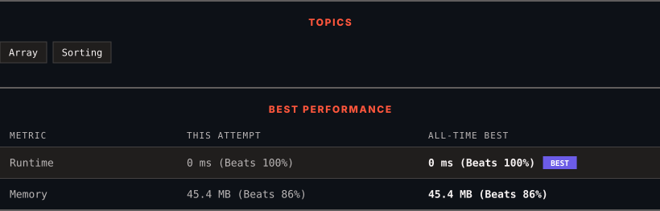

<div align="center">

# 1491. Average Salary Excluding the Minimum and Maximum Salary

      

[](https://leetcode.com/problems/average-salary-excluding-the-minimum-and-maximum-salary/)

</div>

---

<div align="center">

<picture>
  <source media="(prefers-color-scheme: dark)" srcset="panel-dark.svg">
  <source media="(prefers-color-scheme: light)" srcset="panel-light.svg">
  
</picture>

</div>

> **New personal best** — Runtime improved on this submission.

### HOW IT WENT

| | |
|:--|:--|
| **Attempts** | first try |
| **Time to solve** | 39 h 37 min |
| **Verdicts** | ✅ Accepted |

---

### NOTES

_No notes yet._

---

### SOLUTIONS (1)

| # | File | Language | Date |
|:-:|------|:--------:|:----:|
| 1 | [sol1.java](./sol1.java) | `Java` | 2026-10-08 ← **latest** |

---

### PROBLEM DESCRIPTION

You are given an array of **unique** integers `salary` where `salary[i]` is the salary of the `i^th` employee.

Return *the average salary of employees excluding the minimum and maximum salary*. Answers within `10^-5` of the actual answer will be accepted.

 

**Example 1:**

```

**Input:** salary = [4000,3000,1000,2000]
**Output:** 2500.00000
**Explanation:** Minimum salary and maximum salary are 1000 and 4000 respectively.
Average salary excluding minimum and maximum salary is (2000+3000) / 2 = 2500

```

**Example 2:**

```

**Input:** salary = [1000,2000,3000]
**Output:** 2000.00000
**Explanation:** Minimum salary and maximum salary are 1000 and 3000 respectively.
Average salary excluding minimum and maximum salary is (2000) / 1 = 2000

```

 

**Constraints:**

	- `3 <= salary.length <= 100`

	- `1000 <= salary[i] <= 10^6`

	- All the integers of `salary` are **unique**.

---

<div align="center">

<sub>Auto-synced by <strong>LeetSync</strong> · Built by <a href="https://deveshsamant.in/">Devesh Samant</a></sub>

</div>
