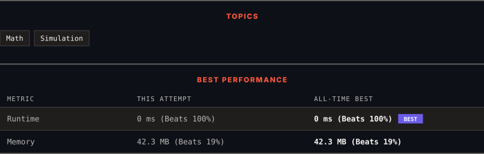

<div align="center">

# 1518. Water Bottles

      

[](https://leetcode.com/problems/water-bottles/)

</div>

---

<div align="center">

<picture>
  <source media="(prefers-color-scheme: dark)" srcset="panel-dark.svg">
  <source media="(prefers-color-scheme: light)" srcset="panel-light.svg">
  
</picture>

</div>

> **New personal best** — Runtime improved on this submission.

### HOW IT WENT

| | |
|:--|:--|
| **Attempts** | first try |
| **Time to solve** | 40 h 50 min |
| **Verdicts** | ✅ Accepted |

---

### NOTES

_No notes yet._

---

### SOLUTIONS (1)

| # | File | Language | Date |
|:-:|------|:--------:|:----:|
| 1 | [sol1.java](./sol1.java) | `Java` | 2026-10-10 ← **latest** |

---

### PROBLEM DESCRIPTION

There are `numBottles` water bottles that are initially full of water. You can exchange `numExchange` empty water bottles from the market with one full water bottle.

The operation of drinking a full water bottle turns it into an empty bottle.

Given the two integers `numBottles` and `numExchange`, return *the **maximum** number of water bottles you can drink*.

 

**Example 1:**


```

**Input:** numBottles = 9, numExchange = 3
**Output:** 13
**Explanation:** You can exchange 3 empty bottles to get 1 full water bottle.
Number of water bottles you can drink: 9 + 3 + 1 = 13.

```

**Example 2:**


```

**Input:** numBottles = 15, numExchange = 4
**Output:** 19
**Explanation:** You can exchange 4 empty bottles to get 1 full water bottle. 
Number of water bottles you can drink: 15 + 3 + 1 = 19.

```

 

**Constraints:**

	- `1 <= numBottles <= 100`

	- `2 <= numExchange <= 100`

---

<div align="center">

<sub>Auto-synced by <strong>LeetSync</strong> · Built by <a href="https://deveshsamant.in/">Devesh Samant</a></sub>

</div>
