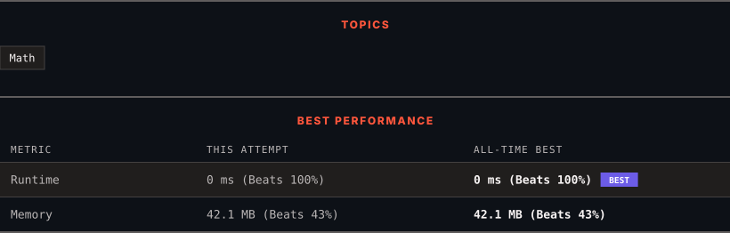

<div align="center">

# 1523. Count Odd Numbers in an Interval Range

      

[](https://leetcode.com/problems/count-odd-numbers-in-an-interval-range/)

</div>

---

<div align="center">

<picture>
  <source media="(prefers-color-scheme: dark)" srcset="panel-dark.svg">
  <source media="(prefers-color-scheme: light)" srcset="panel-light.svg">
  
</picture>

</div>

> **New personal best** — Runtime improved on this submission.

### HOW IT WENT

| | |
|:--|:--|
| **Attempts** | 3 before accepted |
| **Time to solve** | 34 min |
| **Verdicts** | ⏱ Time Limit Exceeded → ⏱ Time Limit Exceeded → ✅ Accepted |

---

### NOTES

_No notes yet._

---

### SOLUTIONS (1)

| # | File | Language | Date |
|:-:|------|:--------:|:----:|
| 1 | [sol1.java](./sol1.java) | `Java` | 2026-10-05 ← **latest** |

---

### PROBLEM DESCRIPTION

Given two non-negative integers `low` and `high`. Return the *count of odd numbers between *`low`* and *`high`* (inclusive)*.


 


**Example 1:**


```

**Input:** low = 3, high = 7
**Output:** 3
**Explanation: **The odd numbers between 3 and 7 are [3,5,7].
```


**Example 2:**


```

**Input:** low = 8, high = 10
**Output:** 1
**Explanation: **The odd numbers between 8 and 10 are [9].
```


 


**Constraints:**


	- `0 <= low <= high <= 10^9`

---

<div align="center">

<sub>Auto-synced by <strong>LeetSync</strong> · Built by <a href="https://deveshsamant.in/">Devesh Samant</a></sub>

</div>
