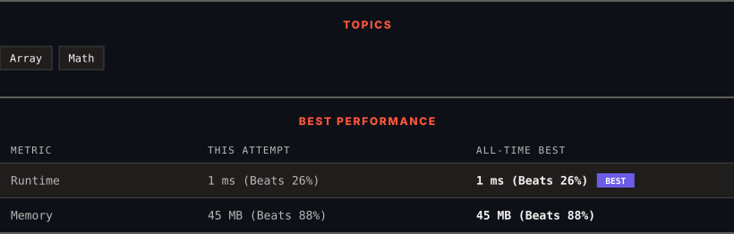

<div align="center">

# 1822. Sign of the Product of an Array

      

[](https://leetcode.com/problems/sign-of-the-product-of-an-array/)

</div>

---

<div align="center">

<picture>
  <source media="(prefers-color-scheme: dark)" srcset="panel-dark.svg">
  <source media="(prefers-color-scheme: light)" srcset="panel-light.svg">
  
</picture>

</div>

### HOW IT WENT

| | |
|:--|:--|
| **Attempts** | 4 before accepted |
| **Time to solve** | 83 h 13 min |
| **Verdicts** | ❌ Wrong Answer → ❌ Wrong Answer → ✅ Accepted → ✅ Accepted |

---

### NOTES

_No notes yet._

---

### SOLUTIONS (2)

| # | File | Language | Date |
|:-:|------|:--------:|:----:|
| 1 | [sol1.java](./sol1.java) | `Java` | 2026-10-04 |
| 2 | [sol2.java](./sol2.java) | `Java` | 2026-10-04 ← **latest** |

---

### PROBLEM DESCRIPTION

Implement a function `signFunc(x)` that returns:

	- `1` if `x` is positive.

	- `-1` if `x` is negative.

	- `0` if `x` is equal to `0`.

You are given an integer array `nums`. Let `product` be the product of all values in the array `nums`.

Return `signFunc(product)`.

 

**Example 1:**

```

**Input:** nums = [-1,-2,-3,-4,3,2,1]
**Output:** 1
**Explanation:** The product of all values in the array is 144, and signFunc(144) = 1

```

**Example 2:**

```

**Input:** nums = [1,5,0,2,-3]
**Output:** 0
**Explanation:** The product of all values in the array is 0, and signFunc(0) = 0

```

**Example 3:**

```

**Input:** nums = [-1,1,-1,1,-1]
**Output:** -1
**Explanation:** The product of all values in the array is -1, and signFunc(-1) = -1

```

 

**Constraints:**

	- `1 <= nums.length <= 1000`

	- `-100 <= nums[i] <= 100`

---

<div align="center">

<sub>Auto-synced by <strong>LeetSync</strong> · Built by <a href="https://deveshsamant.in/">Devesh Samant</a></sub>

</div>
