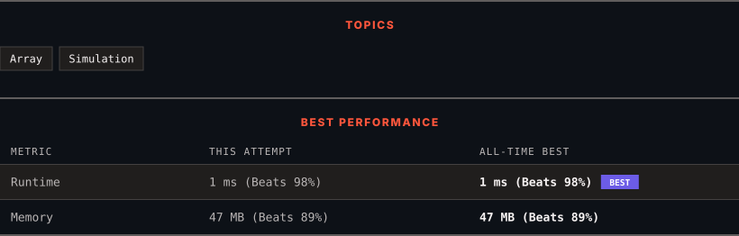

<div align="center">

# 1929. Concatenation of Array

      

[](https://leetcode.com/problems/concatenation-of-array/)

</div>

---

<div align="center">

<picture>
  <source media="(prefers-color-scheme: dark)" srcset="panel-dark.svg">
  <source media="(prefers-color-scheme: light)" srcset="panel-light.svg">
  
</picture>

</div>

> **New personal best** — Runtime improved on this submission.

### HOW IT WENT

| | |
|:--|:--|
| **Attempts** | first try |
| **Time to solve** | 10 h 16 min |
| **Verdicts** | ✅ Accepted |

---

### NOTES

_No notes yet._

---

### SOLUTIONS (1)

| # | File | Language | Date |
|:-:|------|:--------:|:----:|
| 1 | [sol1.java](./sol1.java) | `Java` | 2026-10-09 ← **latest** |

---

### PROBLEM DESCRIPTION

Given an integer array `nums` of length `n`, you want to create an array `ans` of length `2n` where `ans[i] == nums[i]` and `ans[i + n] == nums[i]` for `0 <= i < n` (**0-indexed**).

Specifically, `ans` is the **concatenation** of two `nums` arrays.

Return *the array *`ans`.

 

**Example 1:**

```

**Input:** nums = [1,2,1]
**Output:** [1,2,1,1,2,1]
**Explanation:** The array ans is formed as follows:
- ans = [nums[0],nums[1],nums[2],nums[0],nums[1],nums[2]]
- ans = [1,2,1,1,2,1]
```

**Example 2:**

```

**Input:** nums = [1,3,2,1]
**Output:** [1,3,2,1,1,3,2,1]
**Explanation:** The array ans is formed as follows:
- ans = [nums[0],nums[1],nums[2],nums[3],nums[0],nums[1],nums[2],nums[3]]
- ans = [1,3,2,1,1,3,2,1]

```

 

**Constraints:**

	- `n == nums.length`

	- `1 <= n <= 1000`

	- `1 <= nums[i] <= 1000`

---

<div align="center">

<sub>Auto-synced by <strong>LeetSync</strong> · Built by <a href="https://deveshsamant.in/">Devesh Samant</a></sub>

</div>
